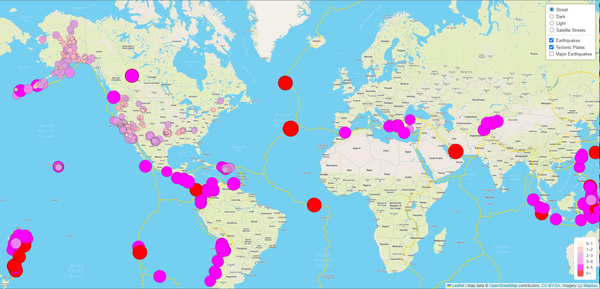
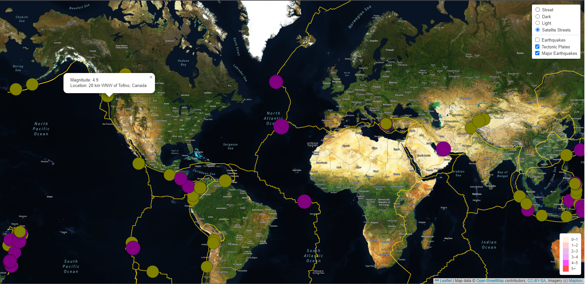
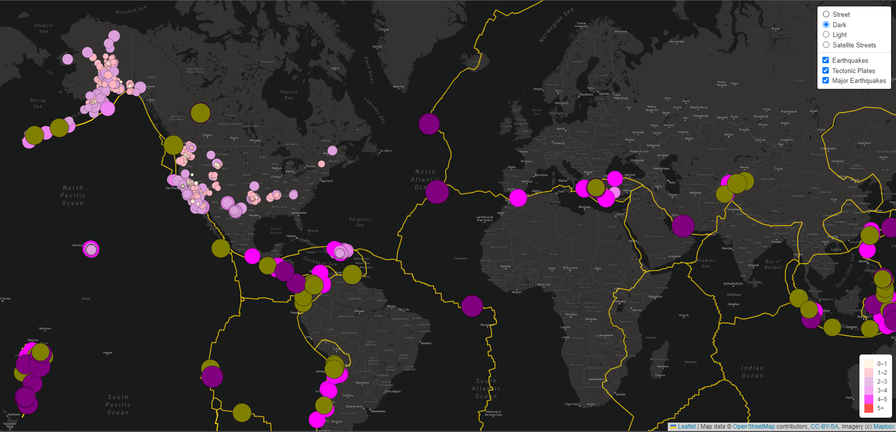

# Mapping_Earthquakes

Creating an Earthquake Mapping App with JavaScript, Leaflet.js, and geoJSON data. 

## Overview

This project develops an application that provides real time Earthquake data to the public using JavaScript, Leaflet.js, and geoJSON data.  

### The application includes 3 layers:

  1. Earthqaukes in the past 7 days
 
  2. Tectonic plate/ fault line layer
 
  3. Major earthquakes (magnitude 4.5 +) in the past 7 days

### and 4 Tile Layer Map Views

  1. Street
  
  2. Dark
  
  3. Light
  
 4. Satellite Streets

## Application Details

### Added Techtonic Plate Data

The Tectonic Plates layer shows fault lines on the map in gold and can be toggled on and off for each of the 4 map tile layer views.

### Added Major Earthquake Data

Major Earthquakes layer shows all eathquakes in the past 7 days with a magnitude of 4.5 and above.
This layer can also be toggled on and off for each of the 4 map tile layer views. The Satellite Streets view is shown here.

### Additional Map

The Dark additional tile layer is shown here with all three map layers toggled on.

I have added this banner in honor of Volodymyr Agafonkin, Ukrainian citizen and developer of Leaflet.js, and the team of Ukrainian developers who continue to maintain Leaflet.js, without whom this project would not have been possible. 
